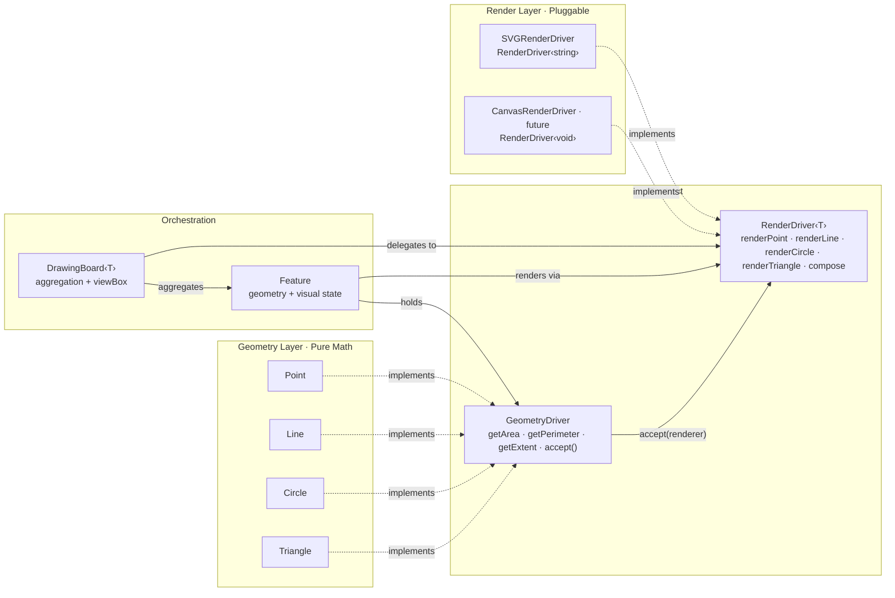

# geometry-2d

[](https://github.com/lao-tseu-is-alive/geometry-2d/actions/workflows/ci-unit-test.yml)
[](https://codecov.io/gh/lao-tseu-is-alive/geometry-2d)
[](https://sonarcloud.io/summary/new_code?id=lao-tseu-is-alive_geometry-2d)
[](https://sonarcloud.io/summary/new_code?id=lao-tseu-is-alive_geometry-2d)
[](https://sonarcloud.io/summary/new_code?id=lao-tseu-is-alive_geometry-2d)
[](https://sonarcloud.io/summary/new_code?id=lao-tseu-is-alive_geometry-2d)
[](https://sonarcloud.io/summary/new_code?id=lao-tseu-is-alive_geometry-2d)

A zero-dependency 2D Geometry library written in strict TypeScript, featuring rigorous mathematical primitives and a pluggable **RenderDriver** architecture for SVG visualization.

* [Documentation](https://lao-tseu-is-alive.github.io/geometry-2d/)
* [Examples](https://github.com/lao-tseu-is-alive/geometry-2d/tree/main/example)

## Features

- **Geometry Primitives** — `Point`, `Line`, `Circle`, `Triangle` with full mathematical operations (dot product, cross product, rotation, projection, reflection, polar coordinates, etc.)
- **RenderDriver Pattern** — Visitor-based double dispatch architecture that cleanly separates geometry math from rendering output
- **SVG Visualization** — Built-in `SVGRenderDriver` producing pure SVG strings with automatic Cartesian-to-Screen Y-inversion
- **Feature Orchestrator** — `Feature` class wrapping any geometry with visual state (stroke, fill, opacity, zIndex) via dependency injection
- **DrawingBoard** — Canvas manager aggregating features with automatic `viewBox` computation, z-ordering, and visibility control
- **Zero Dependencies** — No React, no D3, no DOM libraries. Pure TypeScript.
- **Strictly Typed** — No `any` types. Full `strict` mode TypeScript.

## Architecture

The library follows a three-tier **Driver Pattern** using Visitor-based double dispatch:



**Why this architecture?**

| Concern | Solution |
|---------|----------|
| Geometry stays pure math | No SVG/Canvas knowledge pollutes the mathematical classes |
| Open/Closed for renderers | Adding `CanvasRenderDriver` or `WebGLRenderDriver` requires **zero** changes to geometry classes |
| Type-safe dispatch | Each geometry's `accept()` calls the correct `renderer.renderXxx(this, ...)` — no `switch`, no `instanceof` |
| Generic output | `RenderDriver<string>` for SVG, `RenderDriver<void>` for Canvas2D, etc. |

## Quick Start

### Installation

```bash
bun add @lao-tseu-is-alive/geom-2d-core
bun add @lao-tseu-is-alive/geom-2d-drawing
```

### Basic Usage — Pure Math

```typescript
import { Point, Line, Triangle, Circle, Angle } from "@lao-tseu-is-alive/geom-2d-core";

const A = new Point(0, 0, "A");
const B = new Point(3, 0, "B");
const C = new Point(0, 4, "C");

const triangle = new Triangle(A, B, C);
console.log(triangle.area());       // 6
console.log(triangle.perimeter());  // 12 (3-4-5 right triangle)
console.log(triangle.getExtent());  // [0, 0, 3, 4]
```

### SVG Visualization

```typescript
import { Point, Line, Triangle, Circle, Angle } from "@lao-tseu-is-alive/geom-2d-core";
import { Feature, DrawingBoard, SVGRenderDriver } from "@lao-tseu-is-alive/geom-2d-drawing";

// 1. Create geometry
const circle = new Circle(new Point(50, 50), 30);
const triangle = new Triangle(
  new Point(10, 10),
  new Point(90, 10),
  new Point(50, 80),
);

// 2. Wrap in Features with visual state
const circleFeature = new Feature(circle, {
  stroke: "#3498db",
  strokeWidth: 2,
  fill: "rgba(52, 152, 219, 0.3)",
  zIndex: 1,
});

const triangleFeature = new Feature(triangle, {
  stroke: "#e74c3c",
  strokeWidth: 2,
  fill: "rgba(231, 76, 60, 0.2)",
  zIndex: 0,
});

// 3. Assemble on a DrawingBoard
const board = new DrawingBoard(new SVGRenderDriver(), {
  padding: 10,
  invertY: true,   // Cartesian Y-up → Screen Y-down
  width: 400,
  height: 400,
});

board.add(circleFeature).add(triangleFeature);

// 4. Render to pure SVG string
const svgString = board.render();
// → <svg xmlns="..." viewBox="...">
//     <polygon points="..." stroke="#e74c3c" .../>
//     <circle cx="50" cy="-50" r="30" stroke="#3498db" .../>
//   </svg>
```

### Custom Render Driver

The architecture is designed for extensibility. To target a different output (Canvas2D, WebGL, etc.), implement the `RenderDriver<T>` interface:

```typescript
import { Point, Line, Triangle, Circle, Angle } from "@lao-tseu-is-alive/geom-2d-core";
import { Feature, DrawingBoard, SVGRenderDriver, RenderDriver, RenderOptions, ComposeOptions  } from "@lao-tseu-is-alive/geom-2d-drawing";
import type { Extent } from "@lao-tseu-is-alive/geom-2d-drawing";

class CanvasRenderDriver implements RenderDriver<void> {
  constructor(private ctx: CanvasRenderingContext2D) {}

  renderPoint(point: Point, options: RenderOptions, invertY: boolean): void {
    const cy = invertY ? -point.y : point.y;
    this.ctx.beginPath();
    this.ctx.arc(point.x, cy, options.pointRadius, 0, 2 * Math.PI);
    this.ctx.fillStyle = options.fill;
    this.ctx.fill();
  }

  renderCircle(circle: Circle, options: RenderOptions, invertY: boolean): void { /* ... */ }
  renderLine(line: Line, options: RenderOptions, invertY: boolean): void { /* ... */ }
  renderTriangle(triangle: Triangle, options: RenderOptions, invertY: boolean): void { /* ... */ }
  compose(elements: void[], viewBox: Extent, options: ComposeOptions): void { /* ... */ }
}
```

## API Reference

### GeometryDriver Interface

All geometry classes (`Point`, `Line`, `Circle`, `Triangle`) implement this contract:

| Method | Returns | Description |
|--------|---------|-------------|
| `getArea()` | `number` | Enclosed area (0 for Point, Line) |
| `getPerimeter()` | `number` | Boundary length (0 for Point) |
| `getExtent()` | `Extent` | Bounding box `[minX, minY, maxX, maxY]` |
| `accept(renderer, options, invertY)` | `T` | Visitor dispatch to the correct render method |

### Feature

| Property | Type | Default | Description |
|----------|------|---------|-------------|
| `stroke` | `string` | `"#000000"` | CSS color for stroke |
| `strokeWidth` | `number` | `1` | Stroke width |
| `fill` | `string` | `"none"` | CSS color for fill |
| `opacity` | `number` | `1.0` | Opacity (0–1) |
| `pointRadius` | `number` | `3` | Marker size for Point geometries |
| `isVisible` | `boolean` | `true` | Whether feature is rendered |
| `zIndex` | `number` | `0` | Z-ordering (higher = on top) |

### DrawingBoard

| Method | Description |
|--------|-------------|
| `add(feature)` | Add a feature (chainable) |
| `remove(feature)` | Remove by reference (chainable) |
| `clear()` | Remove all features (chainable) |
| `getGlobalExtent()` | Union bounding box of visible features |
| `render()` | Produce final output via the render driver |

## Development

### Run locally

```bash
git clone https://github.com/lao-tseu-is-alive/geometry-2d.git
cd geometry-2d
bun install
bun run build
bun run dev
```

### Run tests

```bash
bun test
```

### Example

Here is an excerpt of the code in drawPetal.tsx that creates a 6 petals flower using the Point class from the library.
```typescript
    const myAngle = new Angle(angle, 'degrees')
    let radius =  petalLength * (2 + 2 * Math.cos(petalNumber * myAngle.toRadians()))
    let TempPoint = Point.fromPolar(radius, myAngle, `P-${angle}`)
    // and move the point so it's centered
    TempPoint.moveRel(offsetX,offsetY)
```


## License

This project's code is licensed under the terms of the [GNU GPL-3.0 license](https://www.gnu.org/licenses/quick-guide-gplv3.html).

This project was created using `bun init` in bun v1.3.11. [Bun](https://bun.com) is a fast all-in-one JavaScript runtime.
